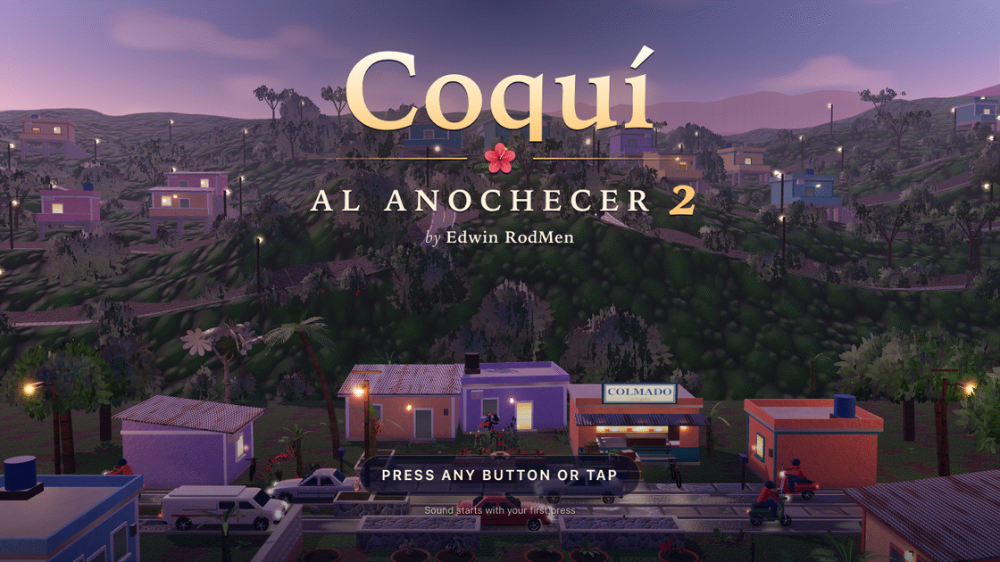
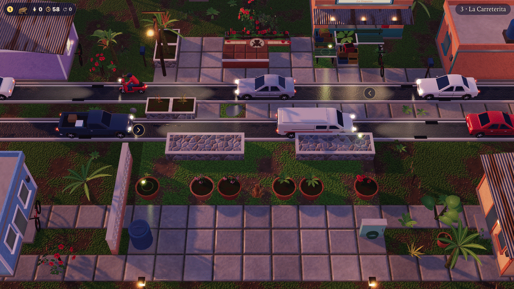
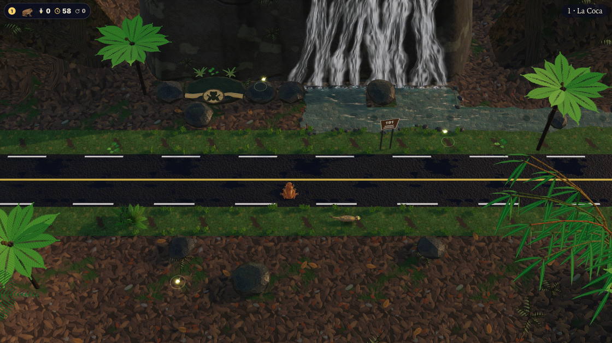
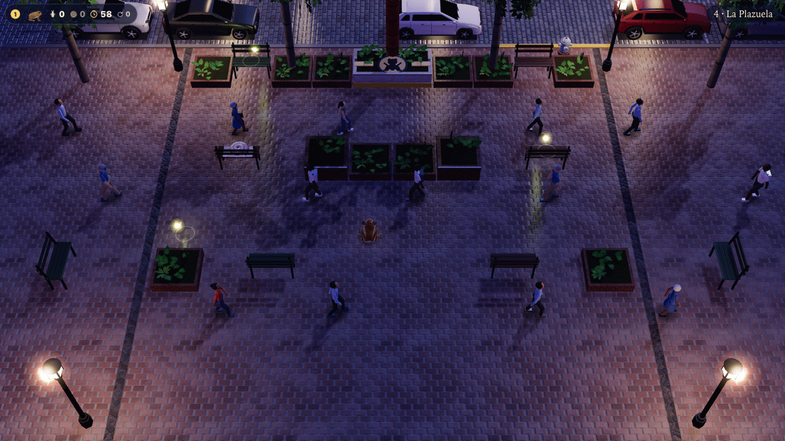
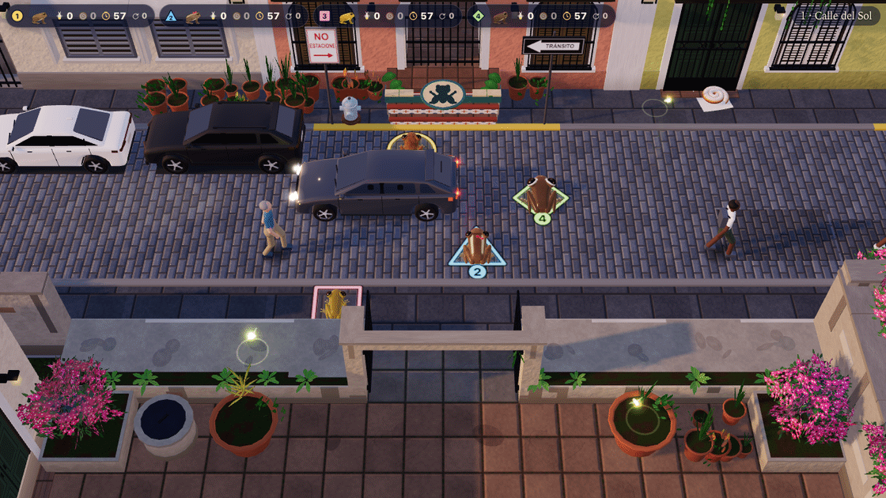
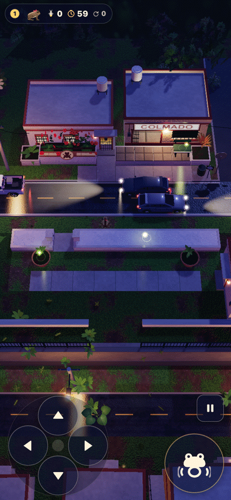

# Coquí al Anochecer 2

*A coquí's evening journey across Puerto Rico, alone or with up to four
friends on one screen.* A browser game by **Edwin RodMen**.

### ▶ [Play it in your browser](https://vibezzzcoder.github.io/coqui-3d/)

No download and no account needed: it runs in a current web browser on a
computer, a phone or a tablet.

> **Version 0.3.0: an early version.** Three of the game's seven regions are
> here: El Barrio, Viejo San Juan and El Yunque, with 20 stages between them. More
> regions arrive in later updates, and the game says so wherever they will be.

## The story so far

This is the sequel to **[Coquí al Anochecer](https://github.com/VibezZzCoder/coqui-snes)**,
the Super NES homebrew game, where a coquí crossed six screens of
one night in a mountain barrio to reach the evening chorus.

The coquí, the little tree frog whose two-note *co-quí* fills every Puerto Rican
night, is out again, and this time the evening goes further. The journey starts
in the barrio of the first game, rebuilt in 3D with heights to climb, and
carries on into the old streets of San Juan and the rainforest of El Yunque. Each region is one evening, from
sunset to full night, and at its end the chorus answers.

|  |  |
|---|---|
|  |  |
|  |  |

*La Carreterita in El Barrio; La Coca in El Yunque; La Plazuela
and four friends on Calle del Sol, in Viejo San Juan.*

## How to play

**Reach the perch.** Every stage is one screen. Your frog starts at the bottom
and hops, one square at a time, to the perch waiting across the way: a
hibiscus, a planter, a leafy bed. With friends, the stage ends when every frog
is on the perch.

**One press, one hop.** Each press is one hop in one of four directions, with
no diagonals, and holding a direction does not repeat. A hop is a commitment:
once you jump, you land. A press made during a hop is remembered and taken the
moment you land.

**Climb.** Walls, steps, pots, benches and ledges can be climbed one level at a
time; hop toward one and your frog climbs on. You can drop from any height.
Raised spots let you wait above ground traffic. In El Yunque, also watch
for crab spiders and the múcaro overhead.

**Call.** Press Call whenever you like and your frog sings its own species'
call. Frogs already on the perch keep singing on their own, so the chorus grows
as friends arrive.

**Insects.** Two or three glowing fireflies hover over squares on every stage.
Hop onto one to catch it for **300** points.

**Hazards.** Cars, motos, pickups and delivery vans on the roads; a hen in the
patio before dusk; a mongoose that rustles in the hedge, then dashes across; the
Puerto Rican boa, long and slow, after dark; and neighbours out walking in the
streets of Viejo San Juan. Arrows at the edge of the screen warn you of
vehicles on their way. El Yunque adds slippery mud, rising water, crab spiders
and the múcaro; watch the forest and choose your moment to hop.

**Tumbles, not lives.** If something catches you, your frog tumbles and pops
back at its own start square. There are no lives and no game over: try again as
often as you like. Nobody else is sent back.

**The bonus clock.** Each frog has 60 seconds of bonus time that runs while it
is on its way, and keeps running while it picks itself up after a tumble.
Reaching the perch is worth **500**, and every second left is worth **10**.

**Help when you want it.** After three tumbles on a stage, press Call while
standing on your start square to show which hops are safe right now. After
five, you can skip to the perch instead: a skipped frog scores the clear points
but no bonus, and the records note the skip. Playing alone, you can also turn
the safe-hop highlight on from the first stage, in Settings.

**End of the evening.** After a region's last stage comes *Evening complete*:
your totals, and a title for every frog, from *Not a Scratch* and *Insect
Hunter* to *Bounce-Back Coquí*, *Biggest Prankster* and *Tumble Champion*.

## Controls

Two players can share one keyboard: one on the left (the WASD half), one on
the right (the arrow half).

| Action | WASD half | Arrow half |
|---|---|---|
| Hop | **W A S D** | **Arrow keys** |
| Call / confirm | **E** or **Space** | **Enter**, **Right Shift**, **Numpad Enter** or **Numpad 0** |
| Back | **Q** | **Backspace** |
| Pause | **Esc** | **P** |

**Keyboard keys can be changed** in Settings → Keyboard: choose an action, then
press its new key. *Reset keys* brings back the defaults.

| Action | Controller |
|---|---|
| Hop | D-pad, or the left stick (one hop per push) |
| Call / confirm | The bottom face button: **A** on Xbox, **✕** on PlayStation, **B** on Nintendo |
| Back | The right face button (**B**, **○**, or **A** on Nintendo), or Back / Select |
| Pause | **Start**, **Options** or **+** |

**On a touch screen**, swipe on the stage to hop, or tap the on-screen arrows.
The large **Call** button calls and the small **Pause** button pauses. The
buttons appear with your first touch: below the stage when the phone is upright,
at the sides when it is turned. Settings → *Touch button size* makes them
smaller or larger.

**In the menus**, move up and down, change a setting with left and right, and
choose with Call. A mouse or a tap works too.

 

## Playing with friends

Up to **four** frogs on one screen: two on the keyboard, the rest on
controllers, and one player can use the touch screen.

1. On **Choose your frogs**, each new player presses Call on their own device:
   **E** on the WASD half, **Enter** on the arrow half, **A** on a controller,
   or *Tap to join* on the touch screen.
2. Pick a frog with left and right, then press Call to get ready. Each frog can
   only be picked once.
3. When everyone is ready, anyone's Call (or a controller's Start) begins.

Press Back to stop being ready, and Back again to leave.

Nobody wins and nobody loses. Everyone crosses at their own pace, and a tumble
only sends that frog back. Hop into a friend and you bump them one square along
(a *Bump!*, or a *Prank!* if they get caught right after). If a controller
disconnects, the game pauses until it comes back, or until someone presses Call
on a free controller or keyboard half to take over that frog.

## The frogs

All four hop, climb and call the same way; they differ in look, size and voice.

| Frog | Species | Look | Call |
|---|---|---|---|
| **Coquí** | Common coquí, male (*Eleutherodactylus coqui*) | Brown, like the first game | *co-quí* |
| **Coquí hembra** | Common coquí, female | Larger, striped, with a ribbon | A soft long note, then short notes |
| **Coquí dorado** | Golden coquí (*E. jasperi*) | Uniform gold, smallest, a tribute | *tweet-tweet-tweet* |
| **Guajón** | Rock frog (*E. cooki*) | Plain brown, big white-rimmed eyes | Low, melodious notes |

With friends, all four frogs are free from the start. Playing alone, you start
with the two common coquís; the guajón joins in Los Guajonales and the golden
coquí in Sierra de Cayey, regions that arrive in later updates. Until then,
bring a friend to play them.

## What's in version 0.3.0

An early version, with **3 of the 7 regions**:

| El Barrio: 7 stages | Viejo San Juan: 6 stages | El Yunque: 7 stages |
|---|---|---|
| 1. El Patio | 1. Calle del Sol | 1. La Coca |
| 2. La Vereda | 2. La Caleta | 2. El Tabonuco |
| 3. La Carreterita | 3. El Callejón | 3. La Poza |
| 4. La Marquesina | 4. La Plazuela | 4. La Palma de Sierra |
| 5. El Colmado | 5. Calle de la Luna | 5. El Palo Colorado |
| 6. El Cafetal | 6. La Escalinata | 6. El Aguacero |
| 7. El Coro | | 7. El Bosque Enano |

### What's new in 0.3

- **El Yunque:** seven rainforest stages, from La Coca to El Bosque Enano,
  with new forest hazards, music and an evening chorus.
- **A loading screen:** follows the game's progress as it gets ready to play.
- **Clearer homes:** a warm landing edge and coquí motif, in materials that
  fit each of the three regions.

Each region's stages run from sunset to full night. Finishing El Barrio carries
you into Viejo San Juan, then El Yunque. **Continue journey** picks up at the
stage you were on, and **Choose region** replays any region you have reached.

More regions arrive in later updates. Until then, the menus mark them *Arrives
in a later update*, and the **Challenges** on the menu, which open after the
whole journey, are still to come as well.

### Mallorcas

Viejo San Juan hides one *mallorca* on each of its stages, on a doorstep or a
bench: Puerto Rico's sugar-dusted spiral sweet bread, fresh from the panadería.
Hop onto it for **500** points. The first frog to land takes it, the results
count how many of the six you found, and the game remembers every one. They are
here because a player of the first game asked for them.

## Settings

| Group | What you can change |
|---|---|
| **Sound** | Master, Music, Night ambience, Frog calls and Effects volumes |
| **Display** | Quality (*Auto* adapts to your device; or High, Medium, Low), Reduce motion, Text size, High-contrast HUD, and a frame-rate readout |
| **Play** | Safe-moment highlight when playing alone, and touch button size |
| **Keyboard** | New keys for both halves of the keyboard, or *Reset keys* |
| **Save data** | *Erase save data*, from the main menu's Settings only, asked twice |

## Saving

The game saves by itself: how far your journey has gone, your best scores and
times, the insects and mallorcas you have found, and your settings. There is no account.

Everything is kept **in this browser, on this device**. Another browser, another
device or a private window starts fresh, and clearing this site's data in your
browser erases the save. On iPhone and iPad, the Home Screen copy of the game
keeps a save of its own, separate from Safari's. Safari also clears a site's
data after seven days of using Safari without visiting it, and playing from the
Home Screen avoids that.

## Put it on your home screen

Added to your home screen, the game opens like an app, without the browser's
address bar and tabs, and the stage gets the whole screen.

**iPhone and iPad (Safari)**

1. Open [the game](https://vibezzzcoder.github.io/coqui-3d/) in Safari.
2. Tap **Share**. On iPhone, Share sits in the menu beside the address bar;
   you can also press and hold the address bar.
3. Tap **Add to Home Screen**. If you don't see it, tap **View More** first.
4. Leave **Open as Web App** on, and tap **Add**.

The game's title screen reminds iPhone players: *Share → Add to Home Screen*.
Chrome on iPhone and iPad can do the same from its Share button.

**Android (Chrome)**

1. Open [the game](https://vibezzzcoder.github.io/coqui-3d/) in Chrome.
2. Tap the **⋮** menu.
3. Tap **Add to Home screen**, **Install app** or **Install and create
   shortcut** (the wording depends on your version of Chrome).
4. Tap **Install**. On Android it opens truly full screen.

**Computer**

| Browser | How |
|---|---|
| Chrome | **⋮** → **Cast, save, and share** → **Install page as app…** |
| Edge | **…** → **Apps** → **Install this site as an app** (in some versions under **More tools**) |
| Safari on a Mac | **File** → **Add to Dock** (macOS Sonoma or later) |

You still need an internet connection to start the game. Once it is open,
nothing more is downloaded.

## Everything is generated in code

There are no image, sound, music or font files in this game. The 3D world, the
frogs, their textures and the evening sky are built by the game's own code as
it runs; every call, every sound and all of the music is synthesized by that
code while you play; and the text uses your device's own fonts. The only
pictures here are the icons, drawn from the game's own frog art, and the
screenshots in `media/`, captured from this very build.

## Troubleshooting

- **No sound?** Browsers keep sound off until your first key press, click or
  tap. A controller button alone can't start it, so press a key or tap the
  screen once. Then check the volumes in Settings.
- **iPhone in Silent mode?** The game asks iPhone and iPad to treat its sound
  like music playback, so on iOS 17 or later it should play even in Silent
  mode, and it may pause music playing in another app. If you hear nothing,
  turn up the volume with the side buttons.
- **Controller not recognised?** Browsers only reveal a controller after one of
  its buttons is pressed while the game is open. Connect it, then press a
  button; on *Choose your frogs*, press **A** (**✕**, or **B** on Nintendo) to
  join.
- **Upright or sideways?** Both work, on phones and tablets alike. Some stages
  are tall and some are wide, so turning the device can give a stage more room.
- **Choppy?** Try Settings → Quality → Medium or Low, and close other tabs.
- **Stuck on the game's name on a dark screen?** The game needs a current
  browser with JavaScript and WebGL turned on. Try an up-to-date Chrome, Edge
  or Safari.

## Credits

**Coquí al Anochecer 2** is a game by **Edwin RodMen**.

- This game: <https://github.com/VibezZzCoder/coqui-3d>
- Instagram: [@edwin_rodmen](https://www.instagram.com/edwin_rodmen/)
- The first game, *Coquí al Anochecer* for the Super NES: <https://github.com/VibezZzCoder/coqui-snes>

Built with [three.js](https://threejs.org/) (MIT License).

## License

**Free to play, free to share.** Play it as much as you like, and share the
official game, complete and unchanged, with its credits, `LICENSE` and
`NOTICE.md`, always free of charge.

**Videos are welcome.** Stream it, record it, review it and post screenshots,
monetized or not, without asking first.

**Please don't** sell it or charge for access to it; change it, rename it or
rebrand it; pass it off as someone else's; or reuse its code, art, music,
sounds or stages in other work.

The full terms are in [`LICENSE`](LICENSE). [`NOTICE.md`](NOTICE.md) covers
authorship, the places the game depicts, and the three.js license. For anything
else, ask in the [repository](https://github.com/VibezZzCoder/coqui-3d).

## What's in this repository

| File | |
|---|---|
| `index.html` | The whole game, in one file |
| `manifest.webmanifest`, `icons/` | The name and icons for your home screen |
| `media/` | The screenshots above |
| `LICENSE`, `NOTICE.md` | The terms, authorship and notices |
| `SHA256SUMS.txt` | Checksums: `shasum -a 256 -c SHA256SUMS.txt` should report `OK` for every file |

---

© 2026 Edwin RodMen. All rights reserved. · [@edwin_rodmen](https://www.instagram.com/edwin_rodmen/)
